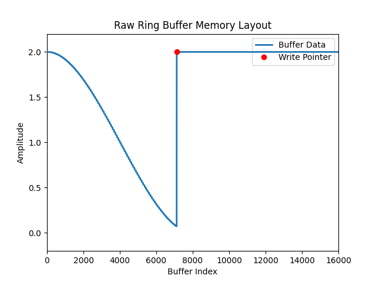

# Ring Buffer & Live Plotter

A simple Python project demonstrating:
1. A **RingBuffer** class for efficiently storing streaming data.
2. A **LivePlotter** class for real-time visualization of the buffer contents using Matplotlib.

## Overview

This repository contains:
- `ring_buffer.py` : Implements a fixed-size circular (ring) buffer. Conatins a class to visualize the buffer.
- `mian.py`: simple example of implementation

### Key Features

- **RingBuffer**:
  - Thread-safe writes (uses a lock).
  - Automatically wraps around and overwrites old data.
  - Allows reading the raw buffer or the latest samples in chronological order.

- **LivePlotter**:
  - Displays the ring buffer contents in real time.
  - Can show data in a “raw memory layout” (where x-axis = buffer indices).
  - Alternatively, can display data in chronological order (oldest to newest left-to-right).
  - Uses `matplotlib.animation.FuncAnimation` for real-time updates.

## Demo

